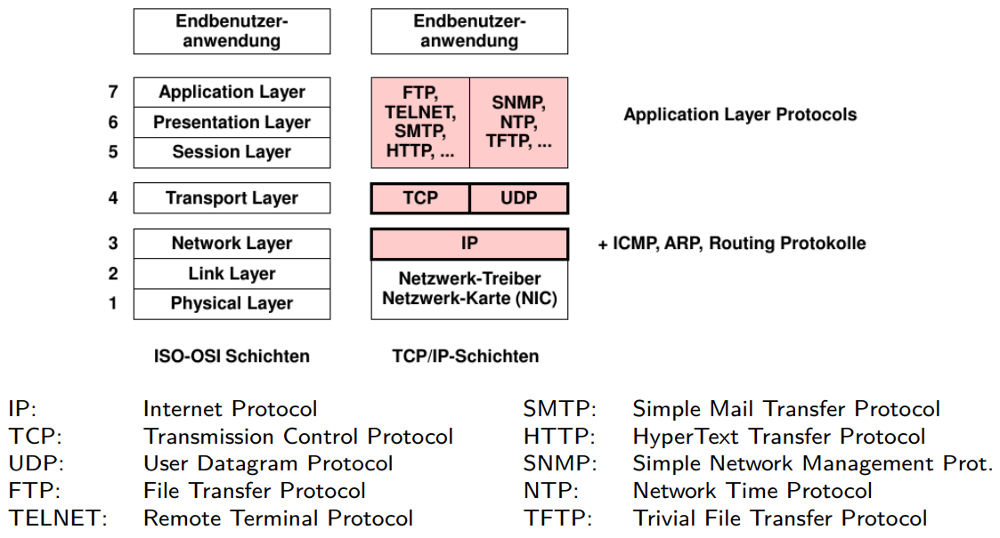

# Kapitel 

## Grundlagen

Richtung des Nachrichtenflusses eines Kanals
* Ein Kanal heisst **gerichtet** oder **unidirektional**, wenn ein Prozess ausschließlich die Sender-Rolle, der andere ausschließlich die Empfänger-Rolle ausübt, ansonsten heißt er **ungerichtet** oder **bidirektional**

Addressierung
* Direkte Adressierung
  * Kommunikationspartner haben eindeutige Adressen
  * Benennung ist **explizit** und **symmetrisch**: ein Sender muss den Empfänger benennen und umgekehrt.

  * Asymmetrische Variante (z.B. für Server-Prozesse):
Nur der Sender benennt den Empfänger, dem Empfänger (Server)
wird mit dem Empfang i.d.R. die Identität des Senders bekannt

* Indirekte Addressierung
  * Kommunikation über zwischengeschaltete Instanzen
  * Vorteile
    * Verbesserte Modularität
    * Erweiterung Zuordnungsmöglichkeiten z.B. m:1, 1:n, usw
    * Zwischeninstanz kann nur weiterleiten, speichern und weiterleiten und Nachrichten transformieren

Pufferung
* Kapazität eines Kanals
* Pufferfähigkeit wird durch einen Warteraum/Warteschlange erreicht
* In verteilten Systemen auf der Empfängerseite gehalten (Rendeszvous-Seite)
* **Keine Pufferung**(Kapazität NULL)
  * Zu inflexibel
  * Beispiel:
    * Ein Sender wird blockiert, wenn seine SEND-Operation vor einer entsprechenden RECEIVE-Operation stattfindet. Wird dann die entsprechende RECEIVE-Operation ausgeführt, wird die Nachricht ohne Zwischenspeicherung unmittelbar vom Sender- zum Empfängerprozess kopiert.
    * Findet umgekehrt RECEIVE zuerst statt, so wird der Empfänger bis zum Aufruf der SEND-Operation blockiert
    * Beispiel: Hoare, Ada-Tasks, Threads in L4 Mikrokern
* **Beschränkte Kapazität**
  * Maximal N Nachrichten zu bestimmten Zeitpunkt
  * SEND-Operation bei nicht vollen Warteraum. Wenn der Raum voll ist, wird der Sender blockiert bis wieder Platz geschaffen wird. Analog wird ein Empfänger bei Ausführung einer RECEIVE- Operation blockiert, wenn der Warteraum leer ist

Synchronisation
* Blocking oder Blockierend
  * Sender kann beim Aufruf blockiert werden
* Non-blocking oder Nicht-blockierend
  * Sender kann beim Aufruf nicht blockiert werden
  * kann damit unmittelbar weiterverarbeiten

Kommunikationsmuster
* One Way: Einzelnachricht ohne Antwort
* Request/Response

* Publisher / Subscriber-Modell
  * Nachrichten klassifiziert in Topics oder Event Channel
  * Empfänger abonnieren Topics (Subscriber)
  * Sender publizieren Nachrichten oder Events (Publisher)

Nachrichtensemantik
* Bytestrom
  * Übergebene Nachrichten verschiedener SEND-Operationen sind als Einheiten nicht mehr identifizierbar. Nachrichtengrenzen gehen verloren.
  * Der Empfänger (und das Nachrichtensystem) sehen ausschließlich eine Folge von Zeichen (Bytestrom).
* Nachrichtencontainer
  * Nachrichten sind für Sender und Empfänger identifizierbare Einheiten fester oder variabler Länge. Nachrichtengrenze bleiben erhalten
  * Die korrekte Interpretation der internen Struktur einer Nachricht obliegt den Kommunikationspartnern
* Typisierte Nachrichten
  * Typ ist Sender und Empfänger und z.T. dem Kommunikationssystem bekannt und wird in Operationen verwendet
  * 

## Internet-Protokolle

* Hauptmerkmale der TCP/IP-Architektur
  * Verbindungsloses Protokoll (IP) auf der Netzwerkebene
  * Netzknoten zur Paketvermittlung
  * Statisches und dynamisches Routing
* TCP,UDP und die Transportebene (Layer 4)
  * Aufgabe TCP (Transmission Controll Protocol)
    * zuverlässiger bidirektionaler Punkt-zu-Punkt Transport eines Bytestroms zwischen Prozessen in Endsystemen
  * Aufgabe UDP (User Datagram Procotol)
    * Best-effort Datagram-Dienst der IP-Netzwerkebene wird Prozessen in Endsystemen zugänglich gemacht
  * TCP Kommunikationsmodell
    * verbindungsorientiert
    * virtuelle Bidirektionale, voll-duplex-fähige Verbindung zwischen Transport-Endpunkten
    * Adressierung durch 16-bit-Portnummern
    * Bytestrom-orientiert, nicht blockweise
  * UDP
    * verbindungsloses Protokoll
    * keine Flusskontrolle, d.h. auf Empfängerseite aufgrund von Puffermangel nicht annehmbare Datagramme werden vom Protokollmodul ohne Mitteilung an den Empfänger verworfen
  * Verbindungslos / Verbindungsorientiert
    * Verbindungsorientierte Anwendungen nutzen im Internet das Transportprotokoll TCP, um vor der eigentlichen Datenübertragung eine virtuelle Verbindung aufzubauen. Dabei werden im Laufe der Kommunikation die Phasen Verbindungsaufbau, Datenübertragung und Verbindungsabbau durchlaufen. Eine verbindungsorientierte Kommunikation ermöglicht es, übertragene IP-Pakete so abzusichern, daß eine wiederholte Übertragung fehlerhafter Pakete jederzeit möglich ist, da während des Datentransfers der Erfolg oder Mißerfolg einer Aktion gemeldet wird.

    * Eine verbindungslose Kommunikation startet dagegen sofort mit der Übertragung von Daten, ohne daß der Empfänger seine Empfangsbereitschaft signalisiert haben muß, kann aber die angesprochenen Dienste der verbindungsorientierten Kommunikation nicht bieten. Im Internet dient dazu das Transportprotokoll UDP.

## Grundlagen der Socket Programmierung
* Einordnung zwischen 4. und 5. Layer

Byte Ordring
* big-endian Rechner (höherwertige Stelle in Byte mit niederer Adresse)
* little-endian Rechner (umgekehrt)

IP-Adressen
* Viele gleichzeitige Verbindungen zwischen Rechnern möglich. In TCP/IP eindeutig identifizierbar durch:
  * Transportschicht-Protokoll
  * IP-Adresse des lokalen Hosts
  * lokale Portnummer
  * IP-Adresse des entfernten Hosts
  * entfernte Portnummer

Arten von Sockets
* Stream Sockets: (SOCK_STREAM)
  * Verlässliche Kommunikation (i.d.R. eines Byte-Stroms) zwischen zwei Endpunkten
  * verbindungsorientiert
* Datagram Sockets: (SOCK_DGRAM)
  * Unzuverlässige Kommunikation von Einzelnachrichten
  * Verbindungslos

Socket Funktionen (Folien 48 - 55 Detaiert)

TCP Aufbau

UDP Aufbau

## Server-Architektur

Einfacher sequentieller Prozess
* Ein Prozess bearbeitet nacheinander die Anfragen aller Klienten
* Problem, wenn Server während der Bearbeitung selbst zum Client gegenüber einem weiteren Server wird: ⇒ der gesamte Server ist blockiert!
* Nachteile:
  * keine Nebenläufigkeit im Server
  * keine Nutzung einer unterlagerter Multiprozessor-Architektur durch einen einzelnen Server möglich.

Klassischer sequentieller Server
* keine interne Blockierung: mehrere Aufträge können überlappend ausgeführt werden

Parallele Server-Prozesse
* Kindprozesse enthalten Gedächtnis für den Zustand der Kommunikation mit jeweils einem Client
* Vorteil: Multiprozessor-Architektur kann genutzt werden

Multithreaded Server
* Automatisches Lösen des Multiplexing-Problems
  * jedem Auftrag wird bei Beginn der Verarbeitung ein Thread fest zugeordnet
  * jeder einzelne Thread kann innerhalb des Servers blockieren, aber Nebenläufigkeit bleibt insgesamt erhalten.

