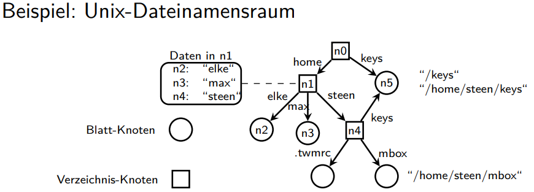
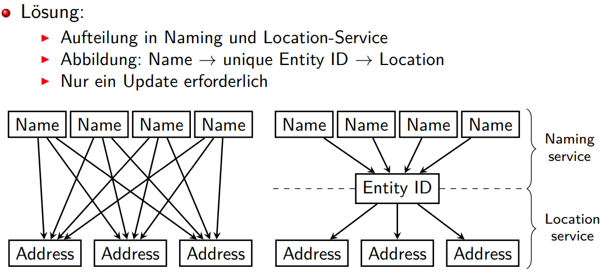

# Kapitel 5

## Namen
* Namen werden genutzt um Objekte zu identifizieren
* Ein Name ist ein Bit- oder Zeichenstring
* Binding: Der Prozess, der einen Namen an ein Objekt bindet

Eigenschaften von Namen:
* **unique**: ein Name indentifiziert höchstens ein Objekt. Z.B. UUID
* **pure/rein**: ein Name ist nur ein Bit-Muster und enthält keinerlei weitere
Information. Z.B. UUID
* **impure/unrein**: ein Name impliziert zusätzliche Information über das
bezeichnete Objekt. Z.B. mail.hs-rm.de, daman herauslesen kann, dass es eine mail ist

### URI, URL und URN
* Ein **Uniform Resource Identifier (URI)** identifiziert eine konkrete Ressource, z.B. ISBN 978-1543057386
* Ein **Uniform Resource Locator (URL)** gibt darüber hinaus an wie auf die Ressource zugegriffen werden kann, z.B. https://www.libra-buchhandlung.de/shop/item/9780131217867
* Ein **Uniform Resource Name (URN)** identifiziert eine konkrete Ressource persistent und ortsunabhängig, z.B. urn:isbn:978-1543057386.

### Namensräume
* Namen haben nur in einem bestimmten Kontext eine Bedeutung
* Namen werden in Namensräume strukturiert
* Namensräume geben die Syntaxregeln für die Namen vor

* Das Objekt eines Namens ist ein weiterer Name
* Weiterleitung bzw. Abbildung eines Namens auf einen anderen Namen

* Um große Namensräume effektiv verwalten zu können, sind diese typischerweise in drei Layer geteilt:
  * Global Layer: High-level Knoten (Einstiegspunkte)
  * Administrative Layer: Namensräume innerhalb einer Organisation
  * Managerial Layer: Namensräume mit Namen, die sich häufig ändern

### Adressen
Adressen sind Attribute von Namen, die genutzt werden können, um mit dem Objekt zu interagieren / zuzugreifen

* Vorteile der Nutzung von Namen gegenüber Adressen
* Ortunabhängig (wünschenswert)
* Besser zu merken
* Abstrahiert von vielen (Protokoll)-Details der Adresse

## Namensdienste

* **Namensauflösung**: Vorgang, um von gegebenem Namen eines Objekts zu seinem Adress-Attribut zu kommen
* Arten der Namensauflösung
  * Suche nach Broadcast
    *  Anfrage wird an alle gesendet; nur die Einheit antwortet, die den Namen auflösen kann
 *  Nutzung Name Server
    *   Es wird ein dedizierter Server gefragt, der die Abbildung hält

## Verzeichnisdienste  (Korrektur wenn MindMap wieder verfügbar)

* Unterschied zu Namensdienst
  * Erweiterung
  * Analogie: "Gelbe Seiten" zu Telefonbuch
  * Im Verzeichnisdienst werden Einträge nicht in erster Linie über ihren Namen gesucht, sondern über Eigenschaften

## Lokationsdienste
Bisherige Architektur kritisch, wenn Objekte schnell ihre (physikalische) Adresse ändern können

### Identifier-Locator Split
Jeder Teilnehmer benötigt zwei Bezeichner (Adressen)
* Ein Identifier (ID) bezeichnet, wer er ist.
* Ein Locator (Loc) bezeichnet, wo er ist.

In statischen Netzen sind beide Bezeichner statisch:
* Können sich deshalb auf eine Adresse reduzieren.
* Im Internet ist die ‚reguläre‘ IP Adresse ID und Loc

In mobilen Netzen ändert sich der Locator
* ID und Loc divergieren: ID-Loc Split
* Netzwerk und Endsysteme müssen Dualität handhaben
