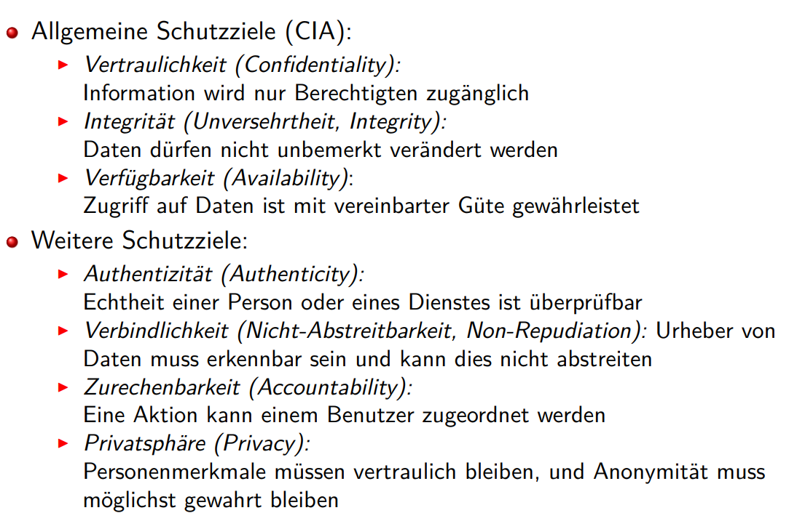
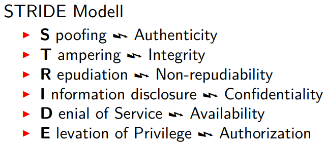
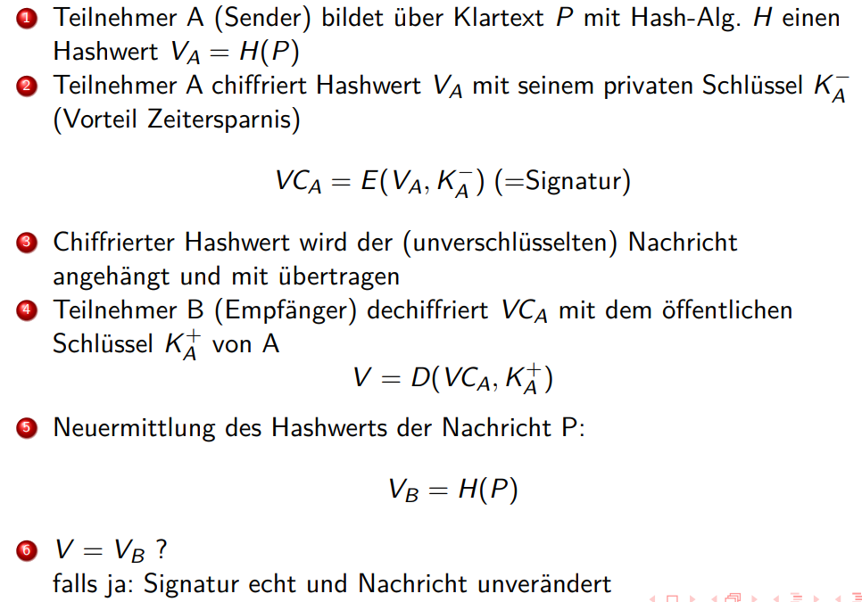

# Kapitel 6 Sicherheit
Informationssicherheit
* „Informationssicherheit hat zum Ziel, die Verarbeitung, Speicherung und Kommunikation von Informationen so zu gestalten, dass die Vertraulichkeit, Verfügbarkeit und Integrität der Informationen und Systeme in ausreichendem Maß sichergestellt wird

Schutzziele

Authentisierung, Authentifikation
* Verifikation einer Identität

Autorisierung
* Ermächtigung: Rechte haben und wahrnehmen können

Bedrohungen

## Verschlüsselungsverfahren

Symmetrische Verfahren
* ein geheimer Schlüssel für Ver- und Entschlüsselung
* Vorteile:
  * kurze Schlüssel (ab mindestens 128 bit heute als brauchbar anzusehen)
  * geringer Rechenaufwand (schnell)
* Probleme:
  * Schlüsselaustausch und -verwaltung (Key Management)
  * keine Verbindlichkeit
* Verfahren
  * Block Algorithmen
  * Strom Algorithmen

Asymmetrische Verfahren
* Schlüssel besteht aus Paar
  * unterschiedliche Schlüssel für Ver- bzw Entschlüsselung
  * Annahme: geheimer Schlüssel kann mit verfügbarem Rechenaufwand nicht aus öffentlichem Schlüssel und Verfahren rekonstruiert werden
* Vorteile:
  * kein sicherer Kanal zur Verteilung von Schlüsseln notwendig, geheimer Schlüssel wird nie übertragen
  * öffentliche Schlüssel leicht verteilbar (Verzeichnisdienst)
  * Verbindlichkeit erreichbar
* Probleme:
  * relativ lange Schlüssel notwendig (ab 2048 bit heute als gut angesehen)
  * hoher Rechenaufwand
  * Vertrauenwürdiges Schlüsselmanagement
* Verfahren
  * RSA-Algorithmus
  * Diffie-Hellman
  * Elliptische Kurven

## Kryptographische Hash-Funktionen
Bildung eines digitalen Fingerabdrucks
über Dokumenten/Nachrichten, genannt Message Digest

Hash-Funktion H
* h = H(P)
* Nachricht P beliebiger Länge
* h Bitkette fester Länge (z.B. 128 Bit)
* vergleichbar zu CRC zur Fehlererkennung

## Authentifizierung
Authentifizierung und Nachrichtenintegrität sind nicht voneinander trennbar
* Vorgehensweise
  1. zuerst sicheren Kanal einrichten mit gegenseitiger Authentifizierung
  2. dann geheimen Sitzungsschlüssel verwenden, um Integrität und Vertraulichkeit sicherzustellen

### Authentifizierung bei geheimen Schlüssel

Authentifizierung mit öffentl. Schlüssel

## Digitale Signaturen
Bedeutung wie Unterschrift
* nicht vom unterschriebenen Dokument zu trennen
* nicht (leicht) fälschbar

Signatur bietet zuverlässige Feststellung von
* Urheberschaft
* Nichtabstreitbarkeit
* Integrität
* Authentizität

schützt nicht Vertraulichkeit des Inhalts
* dazu ist zusätzlich Verschlüsselung notwendig

Kombination aus
* Hash-Algorithmus
* Public Key-Infrastruktur

Ablauf

## Schlüsselverwaltung
Ziel
* Sicheres und effizientes Life Cycle Management von Schlüsseln
* Vertrauen in Schlüsselverwaltung notwendig!

Verschiedene Vorgehensweisen
* bei Umgang mit geheimen Schlüsseln
(Key Distribution Center, KDC)
* bei Umgang mit öffentlichen Schlüsseln
(Public Key Infrastructure, PKI)

KDC Ansatz: Kerberos

PKI-Systeme

Zertifikate
* dienen der Bestätigung der Echtheit eines öffentlichen Schlüssels
* d.h. der Zugehörigkeit zu einer bestimmten Entität,
wie Person, Dienst, ...

## Protokolle und Anwendungen

## Firewalls

Ziele
* Monitoring aller eingehenden (und ausgehenden) Nachrichten
* Eindringlinge verhindern
* autorisierten Zugriff erlauben
* möglichst geringe Performance-Einbußen

Annahme
* Firewall ist selbst sicher und nicht angreifbar

### Paket Filter
Regeln für das Nichtweiterleiten
* Sperren von Subnetzen
* Sperren von Rechnern
* Sperren von Diensten
* basierend auf IP-Adressen u. Portnummern

